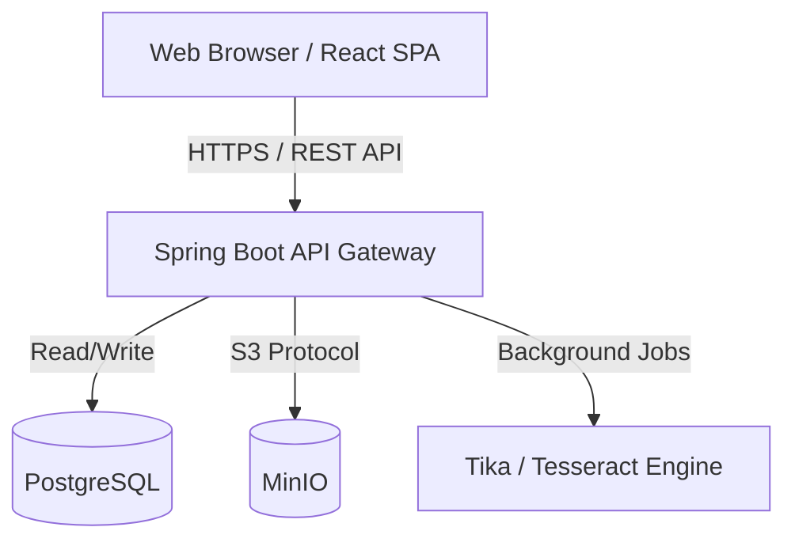

# VaultX Architecture

This document describes the high-level architecture of VaultX.

## System Overview

VaultX is a classic three-tier web application heavily optimized for document processing and secure storage.

## 1. Authentication Flow
VaultX utilizes a stateless JWT (JSON Web Token) architecture. 
- **Login**: User provides email/password. Spring Security validates against BCrypt hashes in PostgreSQL.
- **Token Generation**: If successful, a signed JWT is returned to the client.
- **Stateless Validation**: Every subsequent request includes the `Authorization: Bearer <token>` header. The `JwtAuthenticationFilter` validates the signature and populates the `SecurityContext`. No server-side session state is maintained.

## 2. File Storage Flow
Documents are NEVER stored in the database.
1. Frontend uploads a `MultipartFile`.
2. Backend calculates a SHA-256 checksum for deduplication.
3. Backend uploads the binary stream directly to MinIO using the S3 protocol.
4. Only the metadata (filename, size, S3 path, checksum) is saved to PostgreSQL.

## 3. Intelligent Document Engine (OCR & AI)
When a document is uploaded, an asynchronous event is triggered.
1. **OCR Pipeline**: `OcrEngineService` pulls the file from MinIO. If it's a standard document (PDF, Word), `Apache Tika` extracts text. If it's an image, `Tess4J (Tesseract)` processes it.
2. **AI Classification**: The extracted text is passed to `AiClassificationService`. This offline heuristics engine uses Regex and Keyword matching to identify document types (e.g., Passport, Invoice), extract fields (Passport Number), and calculate expiry dates.
3. **Indexing**: The metadata is saved to `document_ai_metadata`. A PostgreSQL trigger updates the `search_vector` column to enable blazing-fast full-text search across standard metadata AND the OCR text.

## 4. Enterprise Admin Portal
Admin functionality is strictly separated at the routing and controller levels.
- Endpoints under `/api/v1/admin/**` enforce a `@PreAuthorize` or `SecurityConfig` restriction requiring `ROLE_ADMIN` or `ROLE_SUPER_ADMIN`.
- Every admin action (Suspend User, Update Config) writes a record to the `admin_logs` table for compliance auditing.
