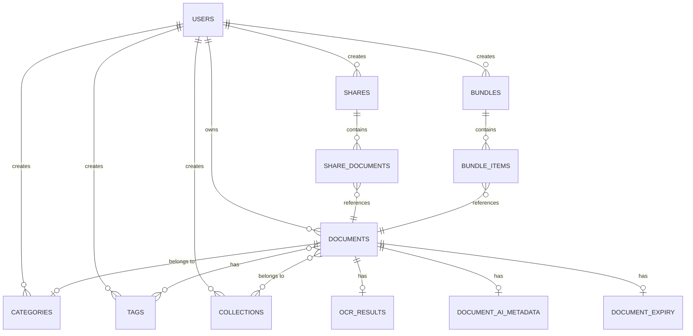

# VaultX Database Schema

The core relational data is stored in PostgreSQL 16. Object binaries (files) are stored in MinIO, with the PostgreSQL database strictly tracking metadata and relationships.

## Entity Relationship Diagram

## Key Tables

### `users`
Core identity table storing email, BCrypt password hash, and active/verified flags. Joined with `roles` via `user_roles`.

### `documents`
The central metadata table.
- **`stored_filename` / `storage_path` / `bucket_name`**: The pointers to the binary file residing in MinIO.
- **`checksum`**: SHA-256 hash used for duplicate detection.
- **`search_vector`**: A `TSVECTOR` column used for native PostgreSQL full-text search.

### `ocr_results` & `document_ai_metadata`
Stores the outputs of the Intelligent Document Engine. `ocr_results.extracted_text` holds raw Tika/Tesseract output, while `document_ai_metadata` holds JSON metadata extracted via AI heuristics.

### `shares`
Handles public, time-expiring, and pin-protected sharing. 
- **`token`**: A unique secure UUID used in public URLs.
- **`expires_at`**: Automates link revocation.

### `admin_logs` & `system_settings`
Enterprise module tables for tracking platform modifications and providing an immutable audit trail of admin actions.
